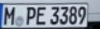
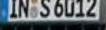

# WPODNet-Pytorch
<table>
    <tr>
        <td> Example </td>
        <td> </td>
        <td> </td>
        <td> </td>
    </tr> 
    <tr>
        <td> License </td>
        <td></td>
        <td></td>
        <td></td>
    </tr>
    <tr>
        <td> Confidence </td>
        <td> 0.9705 </td>
        <td> 0.9828 </td>
        <td> 0.9987 </td>
    </tr>
</table>

## Introduction
This repository implements the proposed method from **ECCV 2018 paper ["License Plate Detection and Recognition in Unconstrained Scenarios"](https://openaccess.thecvf.com/content_ECCV_2018/papers/Sergio_Silva_License_Plate_Detection_ECCV_2018_paper.pdf)** in PyTorch. \
The model in Keras relates to [sergiomsilva/alpr-unconstrained](https://github.com/sergiomsilva/alpr-unconstrained), which is published by the author.

## Quick Run
1. Install [PyTorch](https://pytorch.org) and required packages in `requirements.txt`
    ```bash
    python3 -m pip install -r requirements.txt
    ```
2. Download the pretrained weight `wpodnet.pth` from [Google Drive](https://drive.google.com/file/d/1vpRs1lsr_xAmRPAIZInETSZrAUD3bpfl/view?usp=sharing)
3. Run inference with single image
    ```bash
    python3 inference.py --source <image path> --weight <weight path> --output <output folder>
    ```

## Future works
1. Inference with GPU
2. Inference with bulk of images or video
3. Introduce training procedure
4. The matrix multiplication seems weird in function `postprocess`, may improve the computation.

## Citation
```bibtex
@inproceedings{silva2018license,
  title={License plate detection and recognition in unconstrained scenarios},
  author={Silva, Sergio Montazzolli and Jung, Cl{\'a}udio Rosito},
  booktitle={Proceedings of the European conference on computer vision (ECCV)},
  pages={580--596},
  year={2018}
}
```