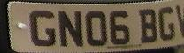
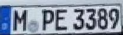
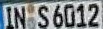

# WPODNet: Build with Torch
## Introduction
This repository implements the proposed method from **ECCV 2018 paper ["License Plate Detection and Recognition in Unconstrained Scenarios"](https://openaccess.thecvf.com/content_ECCV_2018/papers/Sergio_Silva_License_Plate_Detection_ECCV_2018_paper.pdf)** in Torch.

The model in Keras is built by the essay author, see [sergiomsilva/alpr-unconstrained](https://github.com/sergiomsilva/alpr-unconstrained).


<table>
    <tr>
        <td> Example </td>
        <td> </td>
        <td> </td>
        <td> </td>
    </tr> 
    <tr>
        <td> Annotated </td>
        <td></td>
        <td></td>
        <td></td>
    </tr>
    <tr>
        <td> Warp perspective </td>
        <td></td>
        <td></td>
        <td></td>
    </tr>
    <tr>
        <td> Confidence </td>
        <td> 0.9841 </td>
        <td> 0.9945 </td>
        <td> 0.9979 </td>
    </tr>
</table>

## Quick Run
1. Clone this repository
    ```bash
    git clone https://github.com/Pandede/WPODNet-Pytorch.git
    ```
2. Install [PyTorch](https://pytorch.org) depends on your environment.
3. Install packages in `requirements.txt`
    ```bash
    pip3 install -r requirements.txt
    ```
4. Download the pretrained weight `wpodnet.pth` from [Google Drive](https://drive.google.com/file/d/1SPfJIgEBX6j0fQbQryQxRp_sHkEnJnKa/view?usp=share_link)
5. Predict with an image
    ```bash
    python3 predict.py  docs/sample/original/03009.jpg          # The path to the an image
                        # docs/sample/original                  # OR the path to the directory with bulk of images
                        -w weights/wpodnet.pth                  # The path to the weight
                        --save-annotated docs/sample/annotated  # The directory to save the annotated images
                        --save-warped docs/sample/warped        # The directory to save the warped images
    ```

## Future works
- [x] Inference with GPU
- [x] Inference with bulk of images
- [ ] Inference with video
- [ ] Introduce training procedure
- [x] The matrix multiplication seems weird in function `postprocess`, may improve the computation.

## Citation
```bibtex
@inproceedings{silva2018license,
  title={License plate detection and recognition in unconstrained scenarios},
  author={Silva, Sergio Montazzolli and Jung, Cl{\'a}udio Rosito},
  booktitle={Proceedings of the European conference on computer vision (ECCV)},
  pages={580--596},
  year={2018}
}
```
